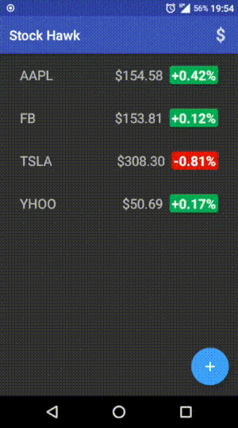
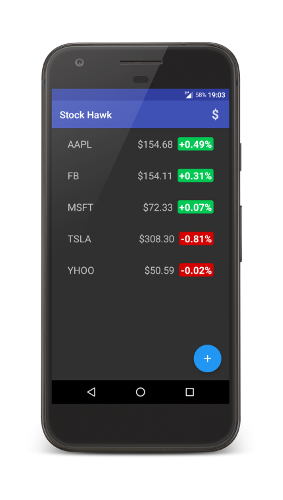
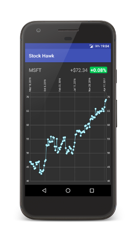
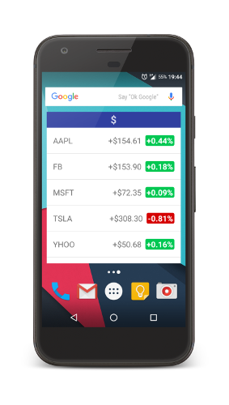

# Stock Hawk

[](https://opensource.org/licenses/Apache-2.0)


**Stock Hawk** is my submission for Project 3 in Udacity's [*Associate Android Developer Fast Track*](https://www.udacity.com/course/associate-android-developer-fast-track--nd818) course supported by Google.
My task was to build upon [starting_state](https://github.com/sakydpozrux/StockHawk/tree/starting_state), fix bugs and add new functionality.




# Screenshots






# Task description

```
Project Overview:
 You will productionize an app, taking it from a functional state to a
 production-ready state. This will involve finding and handling error
 cases, adding accessibility features, allowing for localization,
 adding a widget, and adding a library.

Why this Project?
 Stock Hawk gives you an opportunity to diagnose problems and practice
 improving apps. These skills are vital to building apps users will
 love. Diagnosing issues with existing apps is key to working on large
 apps or continuing projects in Android. Being aware of the common
 pitfalls in app design frees a developer to produce novel app
 experiences without making the same mistakes over and over.

What Will I Learn?
 In this project, you will:

 • Diagnose existing issues with an app.
 • Make an app accessible to sight-impaired users.
 • Allow your app to be localized for distribution in other countries.
 • Handle error cases in Android.
 • Add a widget to your app experience.
 • Leverage the functionality of a library in your app.
 ```


# Evaluation rubric

To pass this project app has to meet [specifications](https://review.udacity.com/#!/rubrics/140/view). This project was reviewed by Udacity code reviewer and was graded positively as it met the requested specifications.

| **Required Components** | Passed |
|----------|-|
| Each stock quote on the main screen is clickable and leads to a new screen which graphs the stock's value over time. | ✓ |
| Stock Hawk does not crash when a user searches for a non-existent stock. | ✓ |
| Stock Hawk Stocks can be displayed in a collection widget. | ✓ |
| Stock Hawk app has content descriptions for all buttons. | ✓ |
| Stock Hawk app supports layout mirroring using both the RTL attribute and the start/end tags. | ✓ |
| Strings are all included in the `strings.xml` file and untranslatable strings have a translatable tag marked to `false`. | ✓ |

| **Required Behavior** | Passed |
|----------|-|
| App conforms to common standards found in the [Android Nanodegree General Project Guidelines](http://udacity.github.io/android-nanodegree-guidelines/core.html). | ✓ |


# Discontinued Yahoo Finance API

Unfortunately Yahoo decided to discontinue their Finance API. As it's only educational demo app I used mocks to simulate data being retrieved from Yahoo server.


# Libraries used

* [MPAndroidChart](https://github.com/PhilJay/MPAndroidChart) - A powerful Android chart view / graph view library
* [ButterKnife](https://github.com/JakeWharton/butterknife) - Fields and methods binding for Android views
* [Yahoo Finance API](http://financequotes-api.com) - Methods for requesting stocks' financial details
* [Timber](https://github.com/JakeWharton/timber) - A logger with a small, extensible API


# License

Copyright 2017 Szymon Koper

Licensed under the Apache License, Version 2.0 (the "License");
you may not use this file except in compliance with the License.
You may obtain a copy of the License at

    http://www.apache.org/licenses/LICENSE-2.0

Unless required by applicable law or agreed to in writing, software
distributed under the License is distributed on an "AS IS" BASIS,
WITHOUT WARRANTIES OR CONDITIONS OF ANY KIND, either express or implied.
See the License for the specific language governing permissions and
limitations under the License.
